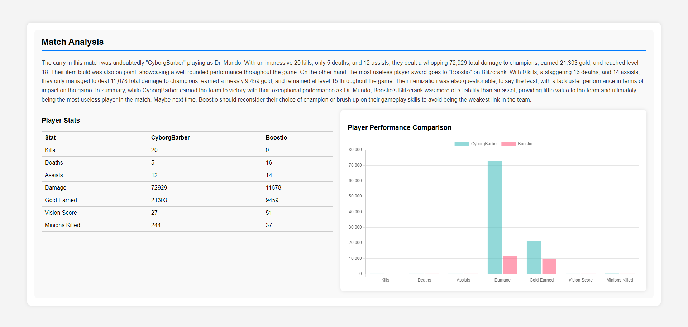

# Riot Games Analysis

This project is a web application that provides an analysis generated by OpenAI's GPT-3.5 model on the player's performance in a League of Legends game. The application consists of a React frontend and a FastAPI backend connected to a PostgreSQL database.



## Features

- Fetches match data using the Riot Games API.
- Analyzes match data using OpenAI's GPT-3.5 model.
- Provides detailed and humorous commentary on player performance.
- Supports custom games with specific messaging.
- Retains user data across page refreshes using localStorage.
- Stores match analysis data in a PostgreSQL database.

## Technologies

- **Front End**: React
- **Back End**: FastAPI
- **Database**: PostgreSQL
- **APIs**: Riot Games API, OpenAI API
- **Language Model Integration**: LangChain

## Installation

### Prerequisites

- PostgreSQL installed and running
- Python and pip installed
- Node.js and npm installed

### Back End

1. Clone the repository and navigate to the `backend` directory.
    ```sh
    git clone <repository_url>
    cd Riot_Games_Analysis/backend
    ```

2. Set up the PostgreSQL database:
    - Open the PostgreSQL shell and log in with your username and password.
    - Create a new database:
        ```sql
        CREATE DATABASE match_analysis;
        ```
    - Connect to the new database:
        ```sql
        \c match_analysis;
        ```
    - Create the `match_analysis` table:
        ```sql
        CREATE TABLE match_analysis (
            id SERIAL PRIMARY KEY,
            match_id VARCHAR(50),
            good_player_name VARCHAR(50),
            good_player_stats JSONB,
            bad_player_name VARCHAR(50),
            bad_player_stats JSONB,
            analysis TEXT
        );
        ```

3. Create a `.env` file in the `backend` directory and add your API keys and database URL in this format:
    ```
    RIOT_API_KEY=your_riot_api_key
    OPENAI_API_KEY=your_openai_api_key
    DATABASE_URL=postgresql://<username>:<password>@localhost:5432/match_analysis
    ```

4. Install the dependencies:
    ```sh
    pip install -r requirements.txt
    ```

5. Run the FastAPI server:
    ```sh
    uvicorn app:app --reload
    ```

### Front End

1. Navigate to the `frontend` directory:
    ```sh
    cd ../frontend
    ```

2. Install npm packages:
    ```sh
    npm install
    ```

3. Start the React application:
    ```sh
    npm start
    ```

## Usage

1. Navigate to [http://localhost:3000](http://localhost:3000) in your desired browser.
2. Enter your League of Legends player name and tag, then click "Submit".
3. Select a match from the list and click "Analyze".
4. View the detailed analysis, player stats, and performance comparison.
